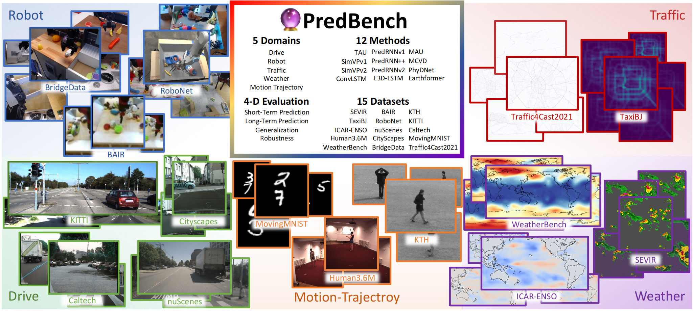
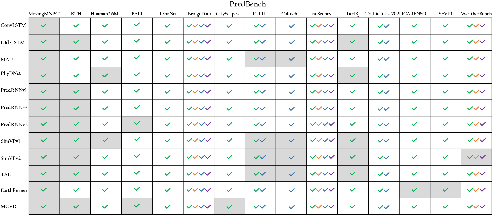
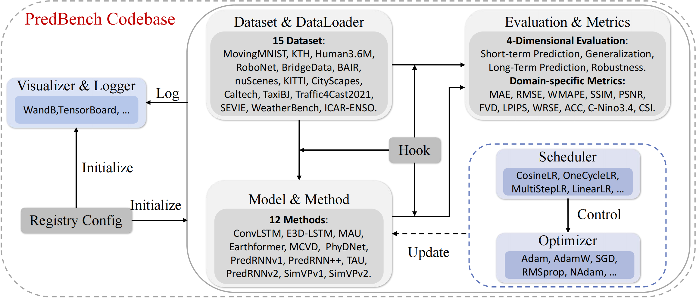

<p align="center" width="100%">
  
</p>


# PredBench: Benchmarking Spatio-Temporal Prediction across Diverse Disciplines

 
This repo contains the official PyTorch codebase of <a href="https://arxiv.org/abs/2407.08418" target="_blank">PredBench</a>. Our paper is accepted by ECCV2024.

## Abstract 
In this paper, we introduce PredBench, a benchmark tailored for the holistic evaluation of spatio-temporal prediction networks. Despite significant progress in this field, there remains a lack of a standardized framework for a detailed and comparative analysis of various prediction network architectures. PredBench addresses this gap by conducting large-scale experiments, upholding standardized and appropriate experimental settings, and implementing multi-dimensional evaluations. This benchmark integrates 12 widely adopted methods with 15 diverse datasets across multiple application domains, offering extensive evaluation of contemporary spatio-temporal prediction networks. Through meticulous calibration of prediction settings across various applications, PredBench ensures evaluations relevant to their intended use and enables fair comparisons. Moreover, its multi-dimensional evaluation framework broadens the analysis with a comprehensive set of metrics, providing deep insights into the capabilities of models. The findings from our research offer strategic directions for future developments in the field. Further, we will release our extensive codebase to encourage and support continued advancements in spatio-temporal prediction research.

## Overview


**We support 12 methods and 15 datasets in our PredBench.** The gray cells represent the settings in which previous methods have been conducted. We **fill the remaining blank cells** by conducting large-scale experiments and thorough evaluation. The green ticks indicate that short-term prediction experiments are conducted, while orange ticks signify the implementation of long-term prediction experiments. The blue ticks represent the execution of generalization experiments, and purple ticks denote experiments in temporal resolution robustness. 

<p align="center" width="100%">
  
</p>


We build a uniform codebase using  <a href="https://github.com/open-mmlab/mmengine" target="_blank">MMEngine</a>.
To ensure reproducibility and coherence, we utilize the codes of each model available on GitHub and make minimal modifications to fit our codebase. 
Our codebase supports modular datasets and models, flexible configuration systems (Config and Hook), and rich analysis tools, resulting in a user-friendly system. It allows easy incoroporation of user-defined modules into any system component.

<p align="center" width="100%">
  
</p>


Codebase Structure
- `configs` contains all the experiment configurations.
- `data` contains all the datasets and their annotations.
- `pre_download` contains some model checkpoints and data that would be used in evaluation and visualization.
- `predbench` contains the core codes of our benchmark.
  - `predbench/datasets` contains the 15 dataset implementations.
  - `predbench/engine` contains some core running modules and plugins, such as hooks and optimizers.
  - `predbench/evaluation` contains core evaluation metric implementations.
  - `predbench/models` contains the 12 model implementations.
  - `predbench/registry.py` supports the global registry mechanism. 
- `tools` contains some useful tools for training, inference and evaluation.
  - `tools/scripts` contains all the scripts for training and evaluation, corresponding to `configs`.
  - Other files supports some specific needs.
- `train.py` and `test.py` provide training and testing pipelines.


## installation
Reproduce the environment by the following commands:
```
conda create -n predbench_env python=3.9
pip install torch==2.0.1 torchvision==0.15.2 --index-url https://download.pytorch.org/whl/cu117
pip install mmcv==2.0.0 -f https://download.openmmlab.com/mmcv/dist/cu117/torch2.0/index.html
pip install mmengine==0.8.4
pip install -r requirements.txt
```
Pre-download the necessary model checkpoints and data by the following commands:
```
bash pre_download/cartopy/download.sh
bash pre_download/i3d/download.sh
bash pre_download/inception/download.sh
```

## Datasets
Our pre-processed datasets will be released in the future.

You can download the Moving-MNIST test set from its official website: https://www.cs.toronto.edu/~nitish/unsupervised_video/. 


## Training and Evaluation
We support multi-node and multi-gpu training.

We have prepared training and evaluation scripts for each model and dataset pair, see `tools/scripts`. The only thing you need to do is to determine the number of nodes and GPUs in your experiments. 

For example, you can run `<PredRNNv1, Moving-MNIST>` experiment using 2 GPU on 1 node through:
```
bash tools/scripts/mnist/predrnnv1/bs_16_lr_5e4.sh 1 2
```
In other cases, you want to run `<SimVPv1, Moving-MNIST>` experiment using 1 GPU on 1 node, just run:
```
bash tools/scripts/mnist/simvpv1/bs_16_lr_1e3.sh 1 1
```

These scripts will automatically train the model and evaluate its best-performance checkpoint. 


## BibTeX
```bibtex
@article{wang2024predbench,
  title={PredBench: Benchmarking Spatio-Temporal Prediction across Diverse Disciplines},
  author={Wang, ZiDong and Lu, Zeyu and Huang, Di and He, Tong and Liu, Xihui and Ouyang, Wanli and Bai, Lei},
  journal={arXiv preprint arXiv:2407.08418},
  year={2024}
}
```